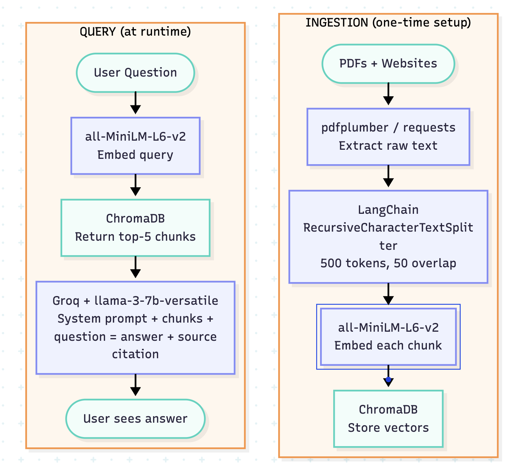

# Project 1 Planning: The Unofficial Guide

> Write this document before you write any pipeline code.
> Your spec and architecture diagram are what you'll use to direct AI tools (Claude, Copilot, etc.) to generate your implementation — the more specific they are, the more useful the generated code will be.
> Update the Retrieval Approach and Chunking Strategy sections if you change your approach during implementation.
> Update this file before starting any stretch features.

---

## Domain

<!-- What domain did you choose? Why is this knowledge valuable and hard to find through official channels? -->
This RAG system covers undergraduate STEM scholarships — eligibility criteria, award amounts, deadlines, and application requirements across federal, institutional, and private programs. The knowledge is hard to find in one place because opportunities are scattered across hundreds of individual program websites, government portals, and nonprofit pages, with no single authoritative source that aggregates them. Students who don't know the right organizations to search often miss scholarships they qualify for entirely.

---

## Documents

<!-- List your specific sources: URLs, subreddit names, forum threads, or file descriptions.
     Aim for at least 10 sources that together cover different subtopics or perspectives within your domain. -->

| # | Source | Description | URL or location |
|---|--------|-------------|-----------------|
| 1 | Goldwater Scholarship | Details on the most prestigious undergrad STEM scholarship — eligibility, criteria, application process | https://goldwaterscholarship.gov |
| 2 | Opportunity Desk | Broad international STEM opportunities; useful for non-US students | https://opportunitydesk.org |
| 3 | College Board Trends in Student Aid 2025 | How much aid exists, what types, trends over time | documents/collegeboard_trends_student_aid_2025.pdf |
| 4 | Sallie Mae — How America Pays for College 2025 | How families actually fund college; financial need context | documents/salliemae_how_america_pays_2025.pdf |
| 5 | NCSES STEM Talent: Education, Training & Workforce | Who enters STEM, demographics, diversity gaps | documents/ncses_stem_talent_indicators.pdf |
| 6 | NCSES Survey of Doctorate Recipients 2023 | STEM/physics workforce outcomes, employment, salaries by field | documents/ncses_stem_workforce_survey_2023.pdf |
| 7 | Lumina Foundation — Some College, No Credential 2025 | Equity gaps, completion rates by demographic | documents/lumina_some_college_no_credential_2025.pdf |
| 8 | NCSES Federal R&D Funding FY 2024–25 | Federal STEM investment and undergraduate funding | documents/ncses_federal_rd_funding_2025.pdf |
| 9 | NCES Trends in Graduate Degrees by Field 2024 | STEM enrollment and degree attainment statistics | documents/nces_stem_enrollment_trends.pdf |
| 10 | CRA Taulbee Survey 2022–2023 | Computing-specific field data and funding pipeline | documents/cra_taulbee_survey_2023.pdf |

---

## Chunking Strategy

<!-- How will you split documents into chunks?
     State your chunk size (in tokens or characters), overlap size, and explain why those
     numbers fit the structure of your documents.
     A review-heavy corpus warrants different chunking than a long FAQ. -->

My documents are all long-form guides — 8 PDFs and 2 websites. The PDFs are dense statistical and policy reports where information is presented as a mix of short data-heavy sentences and longer explanatory paragraphs.

The LLM for this project is **llama-3.3-70b-versatile** with a context window of 131,072 tokens and a max output of 32,768 tokens. The context window is the total budget for everything the model sees in one call — system prompt, user query, and all retrieved chunks combined. A chunk is a small, focused piece of one document — not the full context window. At query time, the top-k most relevant chunks are retrieved from ChromaDB and passed to the LLM together, so the context window is combination of all of them. Each chunk therefore needs to be small enough to represent one specific idea, but large enough that the idea is complete and self-contained.

According to [OpenAI's tokenizer documentation](https://platform.openai.com/tokenizer), 1 token ≈ 0.75 words, meaning 131,072 tokens ≈ 98,000 words total context. A chunk of 500 tokens covers roughly one dense paragraph — enough to contain a complete fact like an eligibility condition or award amount without blending it with unrelated information.

One problem with chunking is that a key fact can span two adjacent chunks, making neither chunk fully self-contained. Overlap solves this by repeating the last N tokens of one chunk at the start of the next, so a fact that straddles a boundary is fully contained in at least one chunk — whichever one the similarity search scores higher gets returned, and the complete fact is already inside it. This problem tho is already solved by combining top-k most relevant chunks from ChromaDB. 

The goal of chunking is to give the embedding model just enough text to form a meaningful, specific vector. In this project, a single paragraph might contain an award amount, an eligibility condition, and a demographic breakdown all at once — making chunk size especially consequential. If chunks are too small, a query like "What is the Goldwater Scholarship award amount?" might return a chunk that just says "$7,500 per year" with no mention of which scholarship it refers to. If chunks are too large, a query about eligibility might pull back 600 words covering eligibility, deadlines, and application tips all blended together — the embedding becomes a blurry average of all those topics and the LLM has to hunt through the noise, sometimes hallucinating rather than admitting it can't find the answer.

In practice: if retrieved chunks feel on-topic but the LLM still gives wrong or vague answers, chunks are too large. If the LLM says "I don't have enough information" even when the answer exists in the documents, chunks are too small.

**Chunk size:** 500 tokens

**Overlap:** 50 tokens

**Reasoning:** Pinecone's chunking documentation recommends 256–512 tokens as the starting range for most document types, with longer chunks suited to dense, structured text where semantic units are paragraphs rather than sentences. My documents — policy reports and statistical surveys — fall squarely in that category, so 500 tokens sits at the upper end of that range intentionally. The 50-token overlap follows the commonly cited 10% rule (overlap ≈ 10% of chunk size), which is enough to catch boundary-spanning facts without duplicating so much content that adjacent chunks become redundant and confuse retrieval. One known limitation: all-MiniLM-L6-v2 has a 256-token input ceiling, so the second half of each 500-token chunk gets truncated before embedding. In practice this is acceptable because the opening sentences of a paragraph typically establish its main topic — the embedding still points to the right content — but it is a real tradeoff worth revisiting if retrieval quality is poor.

---

## Retrieval Approach

<!-- Which embedding model are you using (e.g., all-MiniLM-L6-v2 via sentence-transformers)?
     How many chunks will you retrieve per query (top-k)?
     If you were deploying this for real users and cost wasn't a constraint, what tradeoffs
     would you weigh in choosing a different embedding model — context length, multilingual
     support, accuracy on domain-specific text, latency? -->

**Embedding model:** all-MiniLM-L6-v2 via sentence-transformers. Runs locally with no API key or rate limits, which makes it practical for this project. It maps text into a 384-dimensional vector space, meaning semantically similar text ends up close together — so a query like "who qualifies for the Goldwater Scholarship" can retrieve a chunk that says "nominees must be U.S. citizens enrolled full-time in a STEM degree" even though none of those exact words appeared in the query.

**Top-k:** 5. Retrieving 5 chunks gives the LLM enough context to synthesize a complete answer without flooding it with loosely related content. At 500 tokens per chunk, 5 chunks = ~2,500 tokens, which fits comfortably within the 131,072 token context window alongside the system prompt and user query.

**Production tradeoff reflection:** all-MiniLM-L6-v2 has a 256-token input limit, meaning chunks longer than that get silently truncated before embedding — a real risk for dense policy documents. For a production system, I would consider text-embedding-3-large (OpenAI) for its higher accuracy and longer context support, or a multilingual model like paraphrase-multilingual-MiniLM-L12-v2 since this tool targets students worldwide, many of whom may query in languages other than English. The tradeoff is cost and latency — API-based models charge per token and add network overhead, while local models like all-MiniLM-L6-v2 are free and fast but less accurate on domain-specific text.

---

## Evaluation Plan

<!-- List your 5 test questions with their expected correct answers.
     Questions should be specific enough that you can judge whether the system's response
     is right or wrong. "What are good dining halls?" is too vague.
     "What do students say about wait times at [dining hall name] during lunch?" is testable. -->

| # | Question | Expected answer |
|---|----------|-----------------|
| 1 | What is the annual award amount for the Barry Goldwater Scholarship and how many scholarships are awarded each year? | $7,500 per year; up to 410 scholarships awarded annually to U.S. sophomores and juniors in STEM |
| 2 | What percentage of U.S. undergraduates received grant aid in the most recent reporting year, and what was the average grant amount? | A specific percentage and dollar figure from the College Board Trends in Student Aid 2025 report |
| 3 | What share of computing PhD degrees were awarded to women in the 2022–2023 academic year according to the CRA Taulbee Survey? | A specific percentage from the CRA Taulbee Survey 2022–2023 report |
| 4 | How much did the federal government obligate for academic research and development in FY 2024? | A specific dollar figure in billions from the NCSES Federal R&D Funding FY 2024–25 report |
| 5 | What is the eligibility GPA requirement for the Goldwater Scholarship and what fields of study qualify? | No formal GPA cutoff stated by Goldwater, but nominees are typically in the top of their class; fields include natural sciences, mathematics, and engineering |

---

## Anticipated Challenges

<!-- What could go wrong? Name at least two specific risks with reasoning.
     Consider: noisy or inconsistent documents, missing source attribution, off-topic
     retrieval, chunks that split key information across boundaries. -->

1. **Table data losing meaning during PDF extraction.** During initial testing, pdfplumber extracted table cells as meaningless letter sequences (e.g. "N N N T T X X X") because it reads text left-to-right without understanding table structure. Dollar signs, percentages, and numeric symbols were also dropped due to font encoding issues. Since this RAG is heavily dependent on numeric data (award amounts, funding figures, enrollment percentages), table-heavy chunks are a known limitation. A garbage chunk filter (skipping chunks where >60% of tokens are single characters) was added to prevent these from entering the vector store. The ideal fix would be switching to **docling** (IBM, 2024), which converts tables into structured markdown, but it was ruled out due to personal hardware limitations, because of its 1–2 GB model download requirement and slow first-run processing time .

2. **All-MiniLM-L6-v2 truncating long chunks before embedding.** The model has a 256-token input ceiling, but my chunks are 500 tokens. The second half of every chunk gets silently dropped before the vector is computed. For chunks where the key fact appears late in the paragraph — common in policy reports that lead with context before stating the finding — retrieval will miss it entirely because the embedding never saw it. This could cause the system to confidently return a chunk that looks relevant but doesn't actually contain the answer the student needs.

---

## Architecture

<!-- Draw a diagram of your pipeline showing the five stages:
     Document Ingestion → Chunking → Embedding + Vector Store → Retrieval → Generation
     Label each stage with the tool or library you're using.
     You can use ASCII art, a Mermaid diagram, or embed a sketch as an image.
     You'll use this diagram as context when prompting AI tools to implement each stage. -->

---

## AI Tool Plan

<!-- For each part of the pipeline below, describe:
     - Which AI tool you plan to use (Claude, Copilot, ChatGPT, etc.)
     - What you'll give it as input (which sections of this planning.md, which requirements)
     - What you expect it to produce
     - How you'll verify the output matches your spec

     "I'll use AI to help me code" is not a plan.
     "I'll give Claude my Chunking Strategy section and ask it to implement chunk_text()
     with my specified chunk size and overlap" is a plan. -->

**Milestone 3 — Ingestion and chunking:**
I'll use Claude. I'll paste in the Documents section and Chunking Strategy section from planning.md and ask it to implement `ingest.py` — a script that loads each PDF with **docling** (switched from pdfplumber after discovering it couldn't extract table data or special characters like `$` and `%` correctly), converts them to clean markdown preserving table structure, and splits the text using LangChain's RecursiveCharacterTextSplitter at 500 tokens with 50 token overlap. I'll also ask it to attach source metadata (filename, page number) to each chunk so attribution works downstream. I'll verify by printing 5 random chunks and checking that each is readable, self-contained, and tagged with the correct source file. If I see HTML artifacts, empty strings, or chunks without metadata, I'll ask Claude to debug the specific issue by showing it the bad output. Find problems with chunking and ask AI For mitigation plans. 

**Milestone 4 — Embedding and retrieval:**
I'll use Claude. I'll give it the Architecture diagram, the Retrieval Approach section, and the output schema from Milestone 3 (chunk + metadata), and ask it to implement `embed.py` — a script that loads chunks, embeds them with all-MiniLM-L6-v2, and stores them in ChromaDB with source metadata. I'll also ask it to write a `retrieve.py` function that takes a query string and returns the top-5 chunks with distance scores. I'll verify by running all 5 evaluation questions from planning.md and checking that distance scores are below 0.5 and the returned chunks visibly relate to each question. If retrieval is weak, I'll ask Claude to diagnose whether the issue is chunk size, embedding truncation, or noisy content.

**Milestone 5 — Generation and interface:**
I'll use Claude. I'll give it the full planning.md, the retrieve function from Milestone 4, and the Gradio skeleton from the project instructions, and ask it to wire everything into `app.py` — connecting retrieval to Groq's llama-3.3-70b-versatile with a system prompt that explicitly instructs the model to answer only from retrieved context and to cite sources. I'll verify grounding by asking a question my documents don't cover and confirming the system declines rather than hallucinating. I'll also ask Claude to explain any part of the generated prompt template I don't understand before running it.